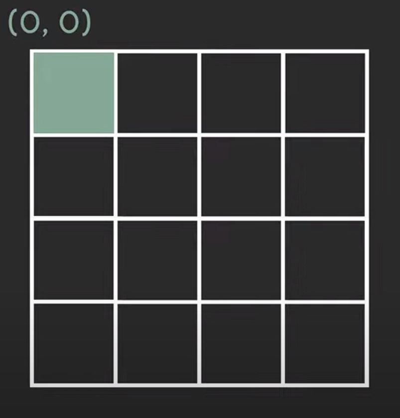
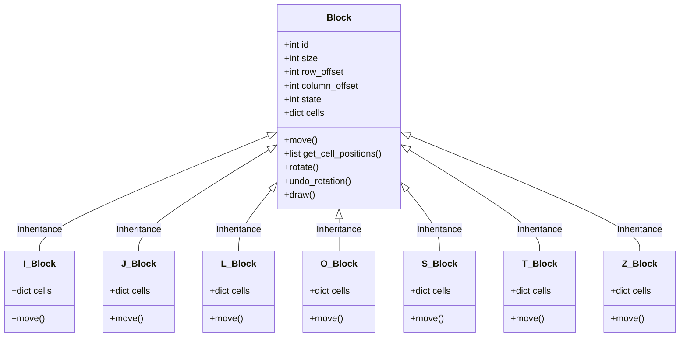

# PyTetris
Clone do Jogo Tetris em Python<br />
Utilizando a biblioteca: PyGame
--
Criado por: Carlos Alberto Morais Moura Filho<br />
em: 17/03/2022<br />
Versão: 1.0<br />
Última atualização: 

## Estrutura do projeto
```shell
→ PyTetris
   ├─→ Assets
   │    ├─→ Images
   │    │    ├─→ icon.png
   │    │    └─→ logo.png
   │    └─→ Sounds
   │         ├─→ clear.wav
   │         ├─→ success.wav
   │         └─→ theme.wav
   ├─→ Classes
   │    ├─→ Blocks
   │    │    ├─→ block.py
   │    │    ├─→ i_block.py
   │    │    ├─→ j_block.py
   │    │    ├─→ l_block.py
   │    │    ├─→ o_block.py
   │    │    ├─→ s_block.py
   │    │    ├─→ t_block.py
   │    │    └─→ z_block.py
   │    ├─→ colors.py
   │    ├─→ grid.py
   │    └─→ position.py
   ├─→ Constants
   │    ├─→ config.py
   │    └─→ texts.py
   └─→ run.py
```

## Os blocos

| State | I | J | L | O | S | T | Z |
| :-: | :-: | :-: | :-: | :-: | :-: | :-: | :-: |
| 0 | <sub><sup>(1, 0) (1, 1) (1, 2) (1, 3)</sub></sup> | <sub><sup>(0, 0) (1, 0) (1, 1) (1, 2)</sub></sup> | <sub><sup>(0, 2) (1, 0) (1, 1) (1, 2)</sub></sup> | <sub><sup>(0, 0) (0, 1) (1, 0) (1, 1)</sub></sup> | <sub><sup>(0, 1) (0, 2) (1, 0) (1, 1)</sub></sup> | <sub><sup>(0,1) (1,0) (1,1) (1,2)</sub></sup> | <sub><sup>(0, 0) (0, 1) (1, 1) (1, 2)</sub></sup> |
| 1 | <sub><sup>(0, 2) (1, 2) (2, 2) (3, 2)</sub></sup> | <sub><sup>(0, 1) (0, 2) (1, 1) (2, 1)</sub></sup> | <sub><sup>(0, 1) (1, 1) (2, 1) (2, 2)</sub></sup> | <sub><sup>-</sub></sup> | <sub><sup>(0, 1) (1, 1) (1, 2) (2, 2)</sub></sup> | <sub><sup>(0,1) (1,1) (1,2) (2,1)</sub></sup> | <sub><sup>(0, 2) (1, 1) (1, 2) (2, 1)</sub></sup> |
| 2 | <sub><sup>(2, 0) (2, 1) (2, 2) (2, 3)</sub></sup> | <sub><sup>(1, 0) (1, 1) (1, 2) (2, 2)</sub></sup> | <sub><sup>(1, 0) (1, 1) (1, 2) (2, 0)</sub></sup> | <sub><sup>-</sub></sup> | <sub><sup>(1, 1) (1, 2) (2, 0) (2, 1)</sub></sup> | <sub><sup>(0,1) (1,1) (1,2) (2,1)</sub></sup> | <sub><sup>(1, 0) (1, 1) (2, 1) (2, 2)</sub></sup> |
| 3 | <sub><sup>(0, 1) (1, 1) (2, 1) (3, 1)</sub></sup> | <sub><sup>(0, 1) (1, 1) (2, 0) (2, 1)</sub></sup> | <sub><sup>(0, 0) (0, 1) (1, 1) (2, 1)</sub></sup> | <sub><sup>-</sub></sup> | <sub><sup>(0, 0) (1, 0) (1, 1) (2, 1)</sub></sup> | <sub><sup>(0,1) (1,0) (1,1) (2,1)</sub></sup> | <sub><sup>(0, 1) (1, 0) (1, 1) (2, 0)</sub></sup> |


